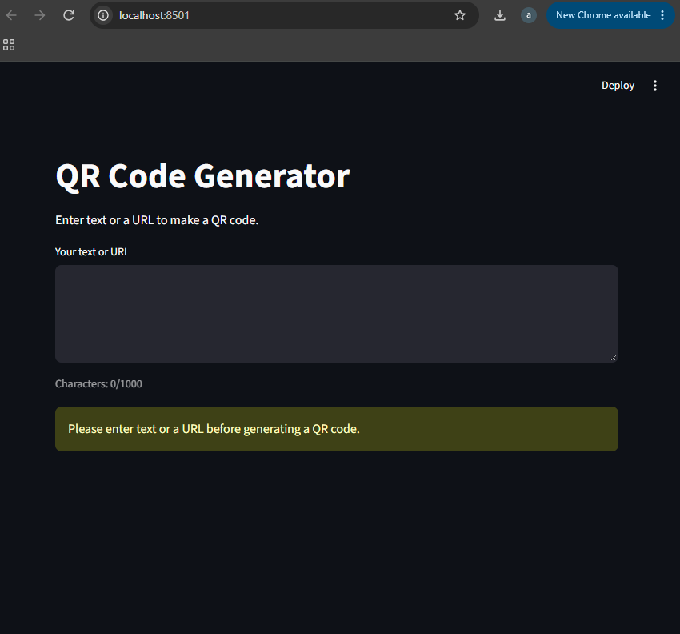

# QR Code Generator

A Streamlit application that generates scannable QR codes from text or URLs.

## Features

- Accepts text or URLs up to 1,000 characters
- Displays a live character counter
- Generates and previews a scannable QR code
- Allows the user to change image size
- Allows the user to select the QR foreground color
- Allows the user to adjust the quiet-zone border
- Warns when a URL appears malformed
- Rejects empty or whitespace-only input
- Downloads the QR code as a PNG with a filename derived from the input
- Generates the image in memory without temporary files

## Screenshot



## How to Run

1. Clone the repository:
   ```bash
   git clone https://github.com/arglil/cit105-week2.git
   
cd cit105-week2


python -m pip install -r requirements.txt

streamlit run app.py


# CIT 105 Week 2 - Function Library Exercise Set

This project contains a Python function library with six reusable functions. Each function returns a result instead of printing it. The `demo.py` file demonstrates valid and invalid inputs for each function.

## Functions

### 1. celsius_to_fahrenheit(c)

Converts a temperature from Celsius to Fahrenheit.

- **Takes:** A number (`int` or `float`) representing Celsius.
- **Returns:** The temperature converted to Fahrenheit.
- **Rejects:** Non-numeric values and Boolean values by raising a `TypeError`.

Example:
`celsius_to_fahrenheit(25)` returns `77.0`.

### 2. line_total(price, qty)

Calculates the total cost by multiplying the price by the quantity.

- **Takes:** A numeric price and a numeric quantity.
- **Returns:** The result of `price * qty`.
- **Rejects:** Non-numeric inputs with a `TypeError` and negative quantities with a `ValueError`.

Example:
`line_total(12.5, 4)` returns `50.0`.

### 3. initials(full_name)

Creates uppercase initials from a full name.

- **Takes:** A string containing a person's full name.
- **Returns:** The first letter of each word in uppercase.
- **Rejects:** Non-string inputs with a `TypeError`.
- **Handles:** Extra spaces and empty strings.

Example:
`initials("Luis De Leon")` returns `"LDL"`.


### 4. is_valid_url(text)

Checks whether a string looks like a valid HTTP or HTTPS web address.

- **Takes:** A string containing a URL.
- **Returns:** `True` if the URL is valid and `False` if it is invalid.
- **Rejects:** Invalid URLs by returning `False`.
- **Handles:** Empty strings, strings containing only spaces, and non-string inputs by returning `False`.

Example:
`is_valid_url("https://google.com/")` returns `True`.


### 5. truncate(text, limit=50)

Shortens text when it exceeds a specified character limit.

- **Takes:** A string and an optional integer limit. The default limit is `50`.
- **Returns:** The original text if it is within the limit, or shortened text with an ellipsis (`...`) if it exceeds the limit.
- **Rejects:** Non-string text, non-integer limits, Boolean limits, and negative limits.

Example:
`truncate("This is a long sentence", 20)` returns `"This is a long se..."`.

### 6. safe_filename(text)

Converts text into a safer filename by removing unsafe characters.

- **Takes:** A string containing the desired filename.
- **Returns:** A filename with spaces replaced by underscores and slashes and quotes removed.
- **Rejects:** Non-string inputs with a `TypeError`.
- **Handles:** Empty strings by returning an empty string.

Example:
`safe_filename("My File 2024")` returns `"My_File_2024"`.


## AI Use Disclosure

GitHub Copilot was used to assist with generating and reviewing the Python functions and demonstration code for this assignment. I reviewed the generated code, tested the functions, and verified that the results met the assignment requirements.

